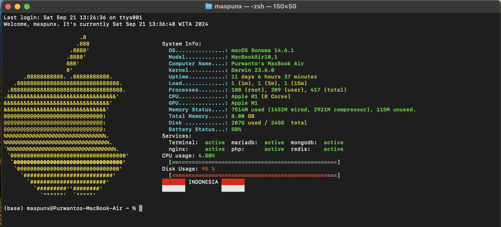

# MOTD for Mac OS

Welcome to the MOTD (Message of the Day) script for macOS Terminal! This script displays a customized greeting message, system information, and a beautifully colored Apple logo every time you open your terminal.

## Features

- Displays a personalized welcome message with the current date and time.
- Shows an Apple logo in golden or green color (if golden is not available).
- Provides detailed system information including CPU usage, disk usage, and active services.
- Displays two Indonesian flags with the text "INDONESIA" in the middle.

## Prerequisites

- macOS Terminal
- Bash shell
- ANSI-compatible terminal for color output

## Installation

1. **Clone the repository:**

    ```sh
    git clone https://github.com/po3nx/motd.git
    ```

2. **Navigate to the directory:**

    ```sh
    cd motd
    ```

3. **Make the scripts executable:**

    ```sh
    chmod +x *.sh
    ```

4. **Add the MOTD script to your `.bash_profile` to run it automatically when a shell is launched:**

    ```sh
    echo "~/path/to/motd/motd.sh" >> ~/.bash_profile
    ```

    Replace `~/path/to/motd/` with the actual path to the cloned repository.

## Usage

Simply open your terminal, and the MOTD script will run automatically, displaying the greeting message, Apple logo, and system information.

## Example Output



## Files

- `motd.sh`: Main script to display the MOTD.
- `apple.txt`: Contains the ASCII art for the Apple logo.
- `sysinfo.sh`: Script to display system information.
- `services.sh`: Script to display active services.
- `cpu.sh`: Script to display CPU usage information.
- `disk.sh`: Script to display disk usage information.
- `flag.sh`: Script to display the Indonesian flags.

## Customization

You can customize the MOTD script by editing `motd.sh` and the individual scripts (`sysinfo.sh`, `services2.sh`, `cpu.sh`, `disk.sh`, `flag.sh`) to suit your preferences.

## Contribution

Feel free to contribute to this project by submitting issues or pull requests. Your contributions are always welcome!

## License

This project is licensed under the MIT License. See the [LICENSE](LICENSE) file for more details.

